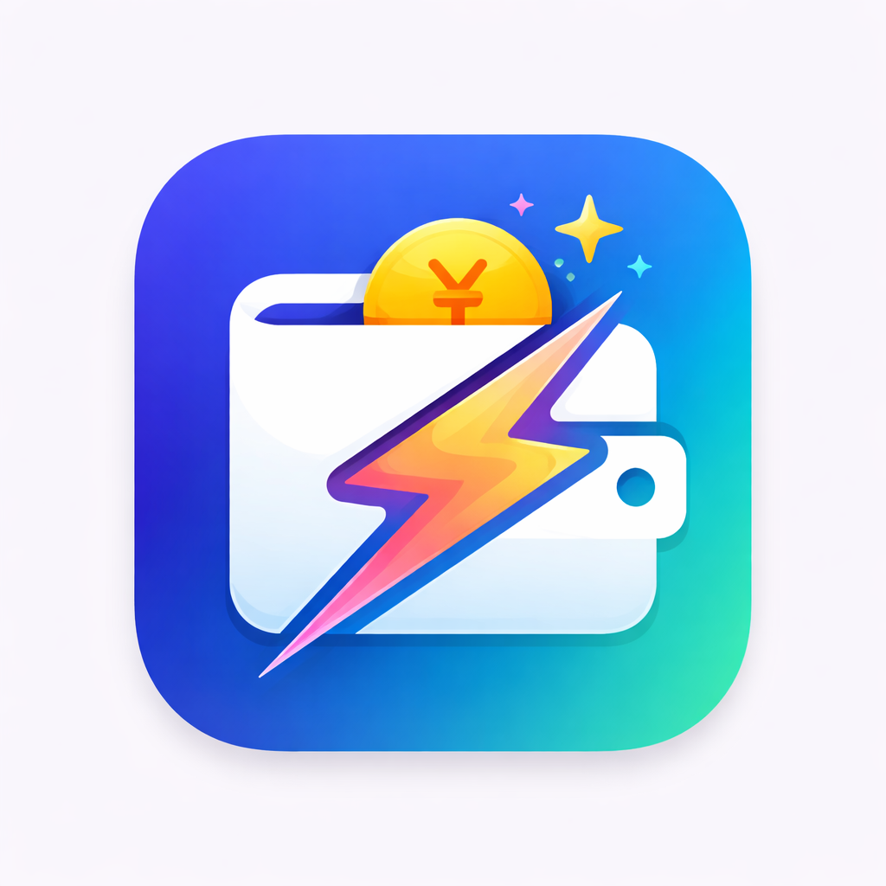

<p align="center">
  <a href="https://app.darkrio326.top/autoledger/">
    
  </a>
</p>

<h1 align="center">AutoLedger</h1>

<p align="center">
  <strong>本地优先的个人自动化账本 + 酒店水单归档工具</strong><br/>
  AutoLedger 是一个本地优先的个人自动化账本。它可以从截图、小票、语音、剪贴板、快捷指令和酒店水单 PDF 中提取消费信息，生成可复核的账本记录。基础记账长期免费；Pro 只解锁邮箱水单、批量候选、专属收件箱等省时间自动化能力。
</p>

<p align="center">
  <a href="README.md">简体中文</a> ·
  <a href="README.zh-Hant.md">繁體中文</a> ·
  <a href="README.en.md">English</a> ·
  <a href="README.ja.md">日本語</a>
</p>

<p align="center">
  <a href="https://github.com/darkrio326/AutoLedger/actions/workflows/xcode-build.yml"></a>
  <a href="https://github.com/darkrio326/AutoLedger/actions/workflows/tests.yml"></a>
  <a href="https://app.darkrio326.top/autoledger/"></a>
  
  
  
</p>

---

## License / Commercial Use

AutoLedger is source-available for learning, personal research, security review, and contributions. Commercial use, white-label publishing, SaaS / hosted redistribution, or republishing a modified app to App Store, Google Play, Steam, Microsoft Store, WeChat Mini Programs, or other public marketplaces requires prior written permission.

You may not remove, bypass, or tamper with Pro / IAP / subscription gates and distribute the result. AutoLedger 名称、图标、截图、官网素材、App Store 素材、付费墙 artwork 和 README 图片不随源码授权；详见 [LICENSE](LICENSE) 与 [docs/brand-assets-notice.md](docs/brand-assets-notice.md)。

## 定位 / Why AutoLedger

AutoLedger 不是又一个需要手工填表的记账 App。它关注的是减少重复输入，把截图、小票、订阅和酒店水单这些零散、混乱的消费材料整理成结构化记录。

识别结果默认进入可复核流程，用户保存前可以检查和编辑。它适合日常支付截图、纸质或电子小票、周期订阅，以及出差 / 旅行后的酒店水单归档。

## Features

### 快速记录

- 截图 / 拍照小票 OCR，自动提取金额、商户和时间。
- 剪贴板和 Share Extension 导入，从任意 App 把支付截图或文本带进账本。
- 语音记账、Siri / 快捷指令和 App Intent 输入。
- iPhone 操作按钮、控制中心 Widget、Apple Watch 快速记录。

### 自动整理

- 规则引擎 + 端侧 LLM 解析，覆盖常见支付截图、小票和账单文本。
- 分类学习与自定义分类 / 来源，记住用户修正后的偏好。
- 订阅识别与提醒，预测周期性扣费。
- 月度报告，展示分类统计、消费趋势和商户排行。
- 多账本，本地账本、账本管理、当前账本 / 全部账本口径和默认写入账本。
- JSON 导出 / 导入与 iCloud 同步 / 备份，便于迁移和恢复。

### 酒店水单工作流

- 手动酒店水单 PDF 导入，使用 PDFKit 提取文本并进入复核。
- Pro 本地邮箱 PDF 候选导入，用户主动扫描并选择要导入的水单附件。
- Pro 专属水单收件箱，接收转发到 AutoLedger 地址的酒店水单候选。
- 保存前候选复核，不自动把识别结果写入正式账本。
- 酒店消费档案，记录酒店、品牌 / 集团、入住退房、晚数、费用拆分和关联流水。

## Free / Pro 边界

Free 会长期保留可用的日常记账能力。AutoLedger 不会把现有核心功能迁到 Pro 后面，也不会用 Pro 锁住用户的账本历史。

Free 包括手动记账、单张截图 / 拍照导入、语音 / 文本输入、手动酒店水单 PDF 导入、酒店历史查看、基础订阅管理、基础月报、Widget / Share Extension、JSON 导入导出、备份，以及历史记录的查看、编辑和删除。

Pro 的定位是省时间自动化，而不是账本访问权限。Pro 包括或将包括本地邮箱水单扫描、批量候选导入、高级去重，以及专属云端水单收件箱。

## 本地优先与云端自动化

AutoLedger 是本地优先应用，核心记账不需要账号。云端水单收件箱是可选自动化能力，只处理用户转发到 AutoLedger 专属地址的邮件附件，在需要时短期暂存来源 PDF，并生成可复核候选。

App 仍要求用户在保存前复核候选结果。云端自动化不会静默创建正式账单，也不会自动把交易写入用户账本。

## Quick Start

**App 内导入** — 打开 AutoLedger → 选择截图 → 识别后确认保存

**一键记账（推荐）** — [安装快捷指令](https://www.icloud.com/shortcuts/e64528fb5bc34afdab4d7c64242d537e) → 绑定操作按钮 → 按一下进入识别 / 确认流程

**语音记账** — 在首页按住麦克风说「午饭 28 元」可快速识别；账本页也可点击波形按钮输入一句话，账本字段会实时生成并可确认保存，也可通过 Siri / 快捷指令触发语音记账

**分享扩展** — 在微信/支付宝中分享截图 → 选择 AutoLedger

## 酒店消费导入

AutoLedger 的酒店消费不是只识别一笔金额，而是把酒店水单整理成可复核的住宿消费档案。

支持的导入入口：

- **手动 PDF 导入**：在酒店消费模块选择或拖入酒店水单 PDF，App 使用 PDFKit 提取文本，并进入酒店水单识别与复核流程。
- **分享 PDF 到 App**：从 Files、Mail 或其他 App 分享酒店水单 PDF 到 AutoLedger，可直接进入酒店消费待确认流程。
- **本地邮箱扫描**：Pro 自动化路径中，用户主动在 App 内连接 IMAP 邮箱，授权码只保存在本机 Keychain；App 拉取带 PDF 附件的候选邮件，用户勾选后批量导入。
- **专属收件箱候选**：Pro 自动化路径中，用户可领取 `folio+<token>@getautoledger.app` 专属地址，手动转发酒店水单邮件或设置自己的邮箱转发规则；Worker 只短期暂存 PDF 候选，App 下载后仍在本机提取文本、识别和复核。

识别目标包括酒店名称、品牌 / 集团、城市 / 国家、入住 / 退房日期、晚数、房型、订单号、币种、房费、税费、服务费、餐饮、其他消费、总额、支付方式、来源文件和识别置信度。确认后会生成 `HotelStayRecord`，并自动关联一条普通支出流水，默认归入酒店住宿分类。

隐私边界：

- Worker 不登录用户邮箱，不保存 QQ / IMAP / Gmail / Outlook 授权码。
- 本地邮箱扫描必须由用户主动触发，结果进入待确认状态，不自动正式入账。
- 云端专属收件箱只处理用户转发到 AutoLedger 地址的邮件，不扫描用户私人邮箱。
- PDF 候选在云端只做短期暂存；App 成功下载 / 转换后会优先删除云端 PDF。
- 用户确认前不会写入正式账本；酒店记录和关联流水仍可在 App 内查看、编辑和删除。

## Screenshot Preview

App Store 截图管线说明：[tools/appstore-screenshots/README.md](tools/appstore-screenshots/README.md)

如需刷新本地截图预览，运行 `bash tools/appstore-screenshots/scripts/export.sh`，然后打开本地生成的 `tools/appstore-screenshots/output/preview.html`。

## Localization & Recognition Packs

AutoLedger 的界面本地化和账单识别语言包是两层独立能力：

- **App UI 语言**：当前主路径覆盖 `zh-Hans` 简体中文、`zh-Hant` 繁体中文、`en` 英文和 `ja` 日文；主 App、Watch、Widget、Control Widget、Share Extension 的 key 集合由 `scripts/check_localization_coverage.py` 校验。
- **App Store 截图语言**：截图管线已按 `zh-Hans` / `zh-Hant` / `en` / `ja` 组织 iPhone、iPad、Mac、Apple Watch、Apple TV 和 visionOS 场景文案；日文截图和商店元数据仍需人工审校后再提交。
- **账单识别语言包**：`AutoLedgerCore` 内置 `zh-Hans`、`zh-Hant`、`en`、`ja` 识别包，承载账单关键词、金额格式、日期格式、分层金额标签、商户标签、非商户排除词、分类关键词和 OCR 语言提示。
- **日文账单识别**：日文包覆盖 `合計`、`小計`、`税込`、`店舗`、`注文番号`、`カフェ`、`コンビニ` 等常见字段；OCR hint 使用 `ja-JP + en-US`，金额和商户 / 分类解析已经进入离线回归。
- **v1.7.0 韩语范围**：计划新增韩语 App UI 和 `AutoLedgerCore` `ko` 识别包，覆盖韩文金额、日期、商户、分类关键词和 `ko-KR + en-US` OCR hint，并补齐韩语 ASC 文案、截图和 golden cases；完成前不把 `ko` 写入当前已支持语言。
- **i18n 发布矩阵**：`versions/v1.7.0-i18n-release-matrix.md` 将每个语言按商店可见（ASC 增加语言）、界面可读（App）、基础识别可用（语言识别包）、真实样本回归、地区支付 / 票据格式专项优化五项门禁管理；后续语言不只做 UI 翻译。
- **扩展原则**：后续语言包以纯数据、版本化、可 fallback 的方式扩展；用户纠错共享必须 opt-in、脱敏、可撤回，并经过审核后才可能进入 reviewed pack。本仓库当前不实现远程语言包热更新或自动上传。

## Tech Stack

| 层级 | 技术 |
|------|------|
| UI | SwiftUI, iOS 17+ deployment target, Xcode 27 / iOS 27 SDK adaptive layout |
| OCR | Apple Vision (`VNRecognizeTextRequest`) |
| 解析 | 规则引擎 + LLM (SmartReceiptParser) |
| LLM | Apple Foundation Models / Gemma-2 2B (MediaPipe LLM Inference) |
| 模型分发 | Cloudflare R2 CDN + SHA-256 (CryptoKit) |
| 存储 | SQLite (本地) |
| 架构 | MVVM + 依赖注入 |
| 依赖管理 | CocoaPods (MediaPipe), SPM (AutoLedgerCore) |
| 快捷指令 | AppIntents / `ForegroundContinuableIntent` |
| 分享 | Share Extension |
| Watch | watchOS 10+, WatchConnectivity |
| Widget | WidgetKit (主屏 & 控制中心) |
| CI | Xcode Cloud |

## Project Structure

```text
AutoLedgerRio/
├── AutoLedger/                    # Xcode 工程
│   ├── AutoLedger/                # 主 App 源码
│   │   ├── App/                   # 入口 & 全局配置
│   │   ├── Features/              # Feedback, Hotel, Inbox, Ledger, Report, Settings, Subscription, iPad
│   │   ├── Domain/                # App 层 Enums、Models、Services、Intents
│   │   ├── Data/                  # DTO、Mapper、Persistence adapter
│   │   ├── Shared/                # 通用组件、常量、扩展
│   │   ├── Screenshots/           # 截图模式 host 与 fixture UI
│   │   ├── Resources/             # 多语言资源与配置
│   │   └── Assets.xcassets/       # 图标与资源
│   ├── AutoLedgerCore/            # 本地 Swift Package (纯 Foundation，跨平台)
│   ├── AutoLedgerWatch Watch App/ # Apple Watch App 源码
│   ├── AutoLedgerWidgets/         # 主屏 Widget Extension
│   ├── AutoLedgerWatchWidgetsExtension/ # watchOS Widget / complication
│   ├── ControlWidgetExtension/    # 控制中心 Widget Extension
│   ├── ShareExtension/            # Share Extension
│   ├── AutoLedgerTV/              # tvOS 只读看板
│   ├── AutoLedgerVision/          # visionOS 展示版
│   ├── Packages/RealityKitContent/# visionOS RealityKit 内容包
│   ├── Pods/                      # CocoaPods 依赖 (gitignored)
│   └── ci_scripts/                # Xcode Cloud CI 脚本
├── AutoLedgerCoreKit/             # Core 相关实验 / 工具包
├── ReceiptDebugTool/              # 小票解析调试工具
├── versions/                      # 版本计划 & 回归基线
├── process/                       # 迭代工作流文档
├── docs/                          # 设计与专项说明文档
├── scripts/                       # 回归测试脚本
├── tests/                         # Golden 回归样例
├── tools/app-icons/               # App Icon 生成与验证工具
├── tools/appstore-screenshots/    # App Store 截图导出管线（zh-Hans / zh-Hant / en / ja）
├── tools/receipt_ocr/             # 小票 OCR 批处理与样本工具
├── tools/worker/                  # Worker / 远端能力实验
└── template/                      # 文档模板
```

## Build

```bash
# 环境要求：Xcode 27 beta + CocoaPods
sudo xcode-select -s /Applications/Xcode-beta.app/Contents/Developer
brew install cocoapods

# 安装依赖
cd AutoLedger
pod install

# 构建 (需使用 workspace)
xcodebuild -workspace AutoLedger.xcworkspace \
  -scheme AutoLedger \
  -destination 'generic/platform=iOS' \
  build

# 回归测试
cd ..
bash scripts/run_offline_regression.sh
bash scripts/run_golden_regression.sh
```

本仓库包含 `Config.example.xcconfig`，仅作为公开协作时的占位示例。真实发布工程没有切换到该示例配置，因此 `main` 合并后仍可作为 AutoLedger 的真实开发和 Xcode Cloud 发布主分支。

如果你要在自己的 Apple Developer 账号下构建，请为 iOS App、Apple Watch App、Share Extension、Widget Extension 分别配置 Bundle ID，并配置自己的 App Groups 与 iCloud Containers。

## Privacy

- AutoLedger 以本地优先为设计目标，默认不需要账号。
- 账单解析尽可能在设备端完成；用户应在保存前确认识别结果。
- 调试导出、反馈包或截图可能包含个人消费数据，请不要在公开 Issue / PR 中上传真实小票、支付截图、账单截图或个人财务信息。
- App Store 版本可能包含签名、entitlement、StoreKit、Xcode Cloud 和商店元数据配置，这些配置不一定属于本仓库公开内容。

## Roadmap

当前仓库主线状态：

- `v1.6.0` 与 `v1.6.1` 已完成并继续对应 ASC / App Store `1.5.0` 大版本口径。
- App Store `1.4.0` 已发布；内部 `v1.5.1` 是该发布线的最终收口版本，`v1.5.0` 作为实现基线并入发布。
- `v1.6.2` 已完成，收口 SDK 适配阶段二、酒店邮箱导入、Deep link / Widget / App Intents、数据可靠性和日文发布材料审校。
- `v1.6.3` 已完成当前范围：酒店 C1 AutoLedger 专属收件箱第一版 App/Core 工程骨架、审核说明和回归 baseline；C2 Worker 登录用户邮箱自动扫描仅保留为个人自用或未来实验路线。
- `v1.6.4` 已进入发布收口阶段，`GOAL-2200` 完成 Free / Pro 边界冻结，新增平台无关 Pro 访问策略合同；Pro 页面、恢复购买 / 管理订阅、本地邮箱月度免费额度、批量候选 gate、高级去重 gate、C1 专属收件箱 Worker / D1 / R2 / Queue、云候选 API 和 App 侧 PDFKit 本地转换入口已落地。Cloudflare production 的 App Store Server API / APNs secret 名称已验证存在；2026-06-29 人工 smoke 已测通订阅开通、APNs 推送、Worker 云收件箱、云候选转酒店消费并入账。订阅元数据、审核材料、生命周期截图和证据归档继续收口。
- `v1.7.0` 规划为 ASC / App Store `1.6.0`：首页“票据扫描”优先升级为实时 OCR 扫描，不支持时回退拍照识别照片 / 相册导入；新增韩语 App UI 和韩语账单识别包；建立 i18n 发布矩阵，按 ASC 商店可见、App 界面可读、识别包可用、真实样本回归和地区支付 / 票据专项优化管理每个语言；建设可复用 `common-api`，用于中简 / 中繁 / 英 / 日 / 韩五语国家城市目录热更新、按日期查询汇率和酒店入住日期历史天气摘要；接入 App Store Server Notifications，补齐 Pro 服务端订阅生命周期；建立 ASC metadata-as-code，用 repo 内配置自动审计并批量更新商店信息、推广文本、描述、新增功能、隐私文本、订阅本地化、截图和 App Preview；同时把 Pro 从酒店水单自动化扩展到全账本效率层，计划实现高级搜索、订阅异常提醒、月结导出包和高级规则自动应用。

| 内部版本 | App Store | 状态 | 主要内容 |
|---------|-----------|------|----------|
| v0.1.0 | — | ✅ 已发布 | MVP：截图导入、OCR、规则解析、分类、账本、月报 |
| v1.0.0 | — | ✅ 已发布 | 一键记账引导、LLM 智能解析、操作按钮集成、图标、TestFlight 外测就绪 |
| v1.1.0 | — | ✅ 已发布 | 订阅识别 & 扣费提醒、分类学习、自定义分类 / 来源、用户反馈闭环、去重增强、最近删除、手动记账、控制中心 Widget |
| v1.2.0 | **1.1.0** | ✅ 已发布 | Gemma-2 2B 端侧 LLM 集成（CDN + SHA-256）、模型生命周期管理、月报图表增强（Swift Charts）、异常消费检测、云闪付 / 银联适配、订阅管理增强、软删除持久化 |
| v1.3.0 | **1.2.0** | ✅ 已发布 | BackupBundle、JSON 导出/导入、覆盖恢复、iCloud 单文件自动备份、重装恢复提示 |
| v1.3.1 | **1.2.0** | ✅ 已发布 | 语音记账 MVP、首页按住语音入口、Siri/AppIntent 入口、App 内确认页、语音来源与调试记录、语音解析回归 |
| v1.3.2 | **1.2.0** | ✅ 已发布 | 统一 `LedgerTextInterpreter` 解析入口，收敛 OCR / 剪切板 / 分享 / 语音 / Siri 多路径 |
| v1.3.3 | **1.2.0** | ✅ 已发布 | 平台无关 `LedgerTextInterpreterCore` 提取为 AutoLedgerCore 模块，批量 OCR 测试框架 |
| v1.3.4 | **1.2.0** | ✅ 已发布 | 规则解析质量提升（合计行优先、商户黑名单、分类映射）、批量报告驱动修复 |
| v1.3.5 | **1.2.0** | ✅ 已发布 | Worker API 可行性评估、712 样本批量回归（金额命中率 100%）、商户别名迁移 |
| v1.4.0 | **1.3.0** | ✅ 已发布 | Apple Watch 端上线（语音记账、今日支出、最近账单）、辅助功能专项、App Intents 增强、中英繁本地化与截图管线、可选 Support Developer 内购 |
| v1.5.0 | **1.4.0** | ✅ 已并入 1.4.0 发布 | iPad 工作台、批量导入 / 批量识别、数据清洗、基础多端数据同步、Watch 今日支出与表盘小组件、iPad / Mac 截图管线、Mac Catalyst 主线能力 |
| v1.5.1 | **1.4.0** | ✅ 已发布 | 最低系统需求优化、识别链路 Core 化、外部辅助识别试点、编辑保存稳定性、iCloud 同步性能、当前平台截图与 App Preview v001；tvOS / visionOS 与多账本顺延 |
| v1.6.0 | **1.5.0** | ✅ 已完成 | 订阅管理补强、AI 订阅判断、商户 / 分类 / 订阅倾向学习缓存、tvOS 只读看板、visionOS 展示版、全平台构建 / TestFlight / ASC / schema / 截图收口 |
| v1.6.1 | **1.5.0** | ✅ 已完成 | 酒店水单识别与酒店消费归档、多账本基础能力、新一轮多语言支持、日文支持、跨平台 App Icon 重绘、iOS 27 可拉伸布局阶段一；商店不区分内部小版本 |
| v1.6.2 | **1.5.0 默认沿用** | ✅ 已完成 | SDK 适配阶段二、酒店邮箱导入草稿队列 / 去重 / 候选批量导入、Deep link Router、Widget / App Intents 第一段、CSV / JSON 与备份恢复 smoke、日文发布材料审校、GOAL-1960 release smoke |
| v1.6.3 | **1.5.0 默认沿用** | ✅ 已完成 | 酒店水单 C1 专属收件箱第一版 App/Core 骨架：`folio+<token>@getautoledger.app` 合同、云候选模型、deep link、PDFKit 本地转换入口、审核说明和回归 baseline；真实 Worker/API 由 1.6.4 接续 |
| v1.6.4 | **1.5.0 默认沿用** | 🚧 收口中 | Personal Pro 订阅基础：Free / Pro 边界已冻结；`ProEntitlementManager`、Pro 页面、恢复购买 / 管理订阅、本地邮箱月度免费额度、批量候选 gate、高级去重 gate、C1 Cloudflare Worker、D1/R2/Queue、云候选 API、App 云候选下载与 PDFKit 转换入口已落地；production secret 名称已验证，2026-06-29 人工 smoke 已测通订阅开通、APNs 推送和云收件箱到入账链路；订阅元数据、审核材料、生命周期截图和证据归档继续收口 |
| v1.7.0 | **1.6.0** | 📝 规划中 | 首页实时 OCR 票据扫描：支持时优先实时识别，不支持时回退拍照识别照片 / 相册导入；韩语 App UI 与 `ko` 识别包；i18n 发布矩阵按 ASC、App、识别包、真实样本和地区票据专项管理多语言扩展；`common-api` 中简 / 中繁 / 英 / 日 / 韩五语地点目录热更新、按日期汇率和酒店历史天气摘要；App Store Server Notifications 与 Pro 服务端生命周期；ASC metadata-as-code 自动审计 / 更新商店信息、截图、App Preview 和订阅本地化；Pro 自动化扩展：高级搜索、订阅异常提醒、月结导出包和高级规则自动应用；免费基础识别、基础搜索、基础订阅、基础导出和历史数据继续可用 |

## License

源码采用 source-available 非商业许可证，详见 [LICENSE](LICENSE)。代码可供学习、研究和贡献参考，但未经书面许可，不允许商业使用、换皮发布、上架修改版 App、SaaS 化、托管服务或绕过 Pro / IAP / 订阅门禁后分发。

AutoLedger 名称、App 图标、App Store 截图、营销素材与品牌素材不随源码授权，相关权利由作者保留。
